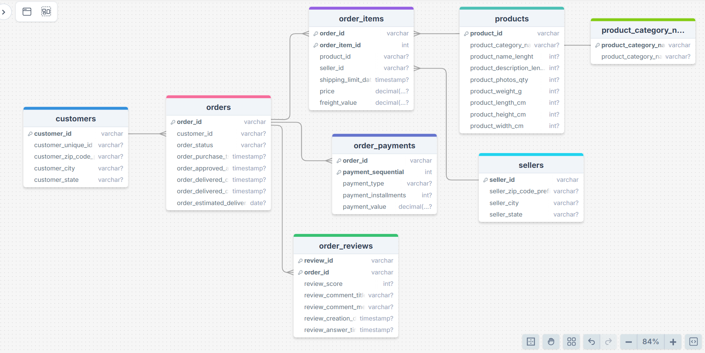

# Описание датасета Brazilian E-Commerce Public Dataset by Olist (Kaggle)

Ниже — **практический data dictionary** для датасета Olist: что за таблицы, какие ключи, как их правильно join`ить и что означают поля.

> Источник датасета: **Olist Store** (100k заказов, 2016–2018, Бразилия). Данные коммерческие, но **анонимизированы**; в текстах отзывов названия магазинов/партнёров заменены на дома из *Game of Thrones*. 

---

## 1. Что это за датасет

**Olist** — маркетплейс/«витрина» продавцов: после покупки продавец получает уведомление, отгружает заказ, дальше клиент оставляет оценку и (иногда) текстовый отзыв.

В датасете можно смотреть один и тот же заказ с разных сторон:

- статусы и даты выполнения заказа,
- позиции заказа (товары),
- платежи и рассрочки,
- доставка (freight) и сроки,
- география клиентов и продавцов,
- отзывы покупателей. 

---

## 2. Какие файлы входят в основной датасет

В «классическом» наборе e-commerce (тот, который чаще всего используют в аналитике/DE-практике) есть 9 CSV:

1. `olist_orders_dataset.csv`
2. `olist_order_items_dataset.csv`
3. `olist_order_payments_dataset.csv`
4. `olist_order_reviews_dataset.csv`
5. `olist_customers_dataset.csv`
6. `olist_sellers_dataset.csv`
7. `olist_products_dataset.csv`
8. `product_category_name_translation.csv`
9. `olist_geolocation_dataset.csv`

---

## 3. Главные связи и «зерно» (grain)

Ключевые факты, которые важно держать в голове:

- **Один заказ может содержать несколько позиций** (items).   
- **Позиции одного заказа могут быть от разных продавцов** (multi-seller). 

Рекомендуемая «звезда» вокруг заказа:

- центр: `order_items` (позиции) или `orders` (заказы) — зависит от задач,
- измерения: `customers`, `products`, `sellers`, + календарь (если строите сами),
- «спутники» заказа: `payments`, `reviews`.

### Join`ы «по умолчанию»

- `orders.order_id` = `order_items.order_id`  
- `orders.order_id` = `order_payments.order_id`  
- `orders.order_id` = `order_reviews.order_id`  
- `orders.customer_id` = `customers.customer_id`  
- `order_items.product_id` = `products.product_id`  
- `order_items.seller_id` = `sellers.seller_id`  
- `products.product_category_name` = `product_category_name_translation.product_category_name`  
- `customers.customer_zip_code_prefix` ≈ `geolocation.geolocation_zip_code_prefix` *(не 1:1!)*  
- `sellers.seller_zip_code_prefix` ≈ `geolocation.geolocation_zip_code_prefix` *(не 1:1!)*  

---

## 4. Data Dictionary по таблицам

Ниже — для каждой таблицы:
- назначение,
- ключи и grain,
- список колонок и смысл.

> Типы данных (INT/FLOAT/TIMESTAMP/VARCHAR) приведены как **рекомендованные** для DWH. В CSV типы не заданы.

---

## 4.1. `olist_orders_dataset.csv`

**Назначение:** «шапка» заказа: статус, ключевые даты жизненного цикла.  
**PK:** `order_id`  
**FK:** `customer_id → customers.customer_id`  
**Grain:** 1 строка = 1 заказ.

**Поля:**
- `order_id` — идентификатор заказа.
- `customer_id` — идентификатор клиента (для джойна с `customers`).
- `order_status` — статус заказа (например: `delivered`, `shipped`, `canceled`, `unavailable` и др.).
- `order_purchase_timestamp` — когда заказ был создан/оплачен в системе (момент покупки).
- `order_approved_at` — когда платеж был подтверждён/апрувнут.
- `order_delivered_carrier_date` — когда заказ передан перевозчику.
- `order_delivered_customer_date` — когда заказ доставлен клиенту.
- `order_estimated_delivery_date` — обещанная (оценочная) дата доставки.

---

## 4.2. `olist_order_items_dataset.csv`

**Назначение:** позиции заказов (детализация до товара/продавца).  
**PK (логический):** (`order_id`, `order_item_id`)  
**FK:**  
- `order_id → orders.order_id`
- `product_id → products.product_id`
- `seller_id → sellers.seller_id`  
**Grain:** 1 строка = 1 позиция товара в заказе.

**Поля:**
- `order_id` — идентификатор заказа.
- `order_item_id` — номер позиции внутри заказа (1..N).
- `product_id` — товар.
- `seller_id` — продавец.
- `shipping_limit_date` — дедлайн, до которого продавец должен отправить товар (по SLA).
- `price` — цена товара в позиции (без доставки).
- `freight_value` — стоимость доставки для позиции (может участвовать в GMV/выручке, зависит от методологии).

---

## 4.3. `olist_order_payments_dataset.csv`

**Назначение:** платежи по заказам (тип платежа, сумма, рассрочка).  
**PK (логический):** (`order_id`, `payment_sequential`)  
**FK:** `order_id → orders.order_id`  
**Grain:** 1 строка = 1 платеж/транзакция по заказу (заказ может иметь несколько платежей).

**Поля:**
- `order_id` — идентификатор заказа.
- `payment_sequential` — порядковый номер платежа по заказу.
- `payment_type` — тип платежа (например: `credit_card`, `boleto`, `voucher`, `debit_card`).
- `payment_installments` — число платежей/взносов (для кредитных карт).
- `payment_value` — сумма платежа.

---

## 4.4. `olist_order_reviews_dataset.csv`

**Назначение:** отзывы и оценка (satisfaction survey) по заказу.  
**PK:** `review_id`  
**FK:** `order_id → orders.order_id`  
**Grain:** 1 строка = 1 review (в классическом использовании — «на заказ», но встречаются нюансы).

**Поля:**
- `review_id` — идентификатор отзыва.
- `order_id` — заказ, к которому относится отзыв.
- `review_score` — оценка (обычно 1..5).
- `review_comment_title` — заголовок комментария (может быть NULL).
- `review_comment_message` — текст комментария (может быть NULL).
- `review_creation_date` — дата создания отзыва.
- `review_answer_timestamp` — когда отзыв был обработан/на него ответили (если применимо).

---

## 4.5. `olist_customers_dataset.csv`

**Назначение:** «клиенты» и их география (упрощённо).  
**PK:** `customer_id`  
**Business key:** `customer_unique_id` *(нормализованный уникальный клиент; один человек может иметь несколько `customer_id` в зависимости от сессии/аккаунта)*  
**Grain:** 1 строка = 1 customer_id.

**Поля:**
- `customer_id` — идентификатор клиента для джойнов с заказами.
- `customer_unique_id` — «настоящий» уникальный клиент.
- `customer_zip_code_prefix` — префикс почтового индекса.
- `customer_city` — город.
- `customer_state` — штат (UF).

---

## 4.6. `olist_sellers_dataset.csv`

**Назначение:** продавцы и их география.  
**PK:** `seller_id`  
**Grain:** 1 строка = 1 продавец.

**Поля:**
- `seller_id` — идентификатор продавца.
- `seller_zip_code_prefix` — префикс индекса.
- `seller_city` — город.
- `seller_state` — штат.

---

## 4.7. `olist_products_dataset.csv`

**Назначение:** справочник товаров и их атрибуты.  
**PK:** `product_id`  
**Grain:** 1 строка = 1 товар.

**Поля:**
- `product_id` — идентификатор товара.
- `product_category_name` — категория товара (на португальском).
- `product_name_lenght` — длина названия (в символах) *(в исходном датасете опечатка: `lenght`)*.
- `product_description_lenght` — длина описания *(опечатка: `lenght`)*.
- `product_photos_qty` — количество фото товара.
- `product_weight_g` — вес (граммы).
- `product_length_cm` — длина (см).
- `product_height_cm` — высота (см).
- `product_width_cm` — ширина (см).

---

## 4.8. `product_category_name_translation.csv`

**Назначение:** перевод категорий товаров (PT → EN).  
**PK:** `product_category_name`  
**Grain:** 1 строка = 1 категория.

**Поля:**
- `product_category_name` — категория на португальском (ключ для джойна с `products`).
- `product_category_name_english` — категория на английском.

---

## 4.9. `olist_geolocation_dataset.csv`

**Назначение:** геокодинг по префиксу индекса (zip prefix → координаты/город/штат).  
**PK:** отсутствует (таблица содержит много строк на один prefix)  
**Grain:** 1 строка = одно наблюдение геолокации для `zip_code_prefix`.

**Поля:**
- `geolocation_zip_code_prefix` — префикс почтового индекса.
- `geolocation_lat` — широта.
- `geolocation_lng` — долгота.
- `geolocation_city` — город.
- `geolocation_state` — штат.

---

## 5. Практические подсказки для аналитики

### 5.1. Что считать «выручкой» (GMV) в Olist
В датасете есть два денежных поля на позиции:
- `price` (товар),
- `freight_value` (доставка).

Частые варианты:
- GMV без доставки: `sum(price)`
- GMV с доставкой: `sum(price + freight_value)`
- отдельно считать доставку: `sum(freight_value)` как cost/fee компонент.

### 5.2. Delivery performance
Сроки обычно считают так:
- фактическая доставка: `order_delivered_customer_date - order_purchase_timestamp`
- задержка относительно обещания: `order_delivered_customer_date - order_estimated_delivery_date`

Важно: в недоставленных/отменённых заказах многие даты будут NULL.

### 5.3. Review coverage
У части заказов не будет текста отзыва (NULL), иногда — и самого отзыва.

---

## 6. ERD

## 7. Что дальше

Если вы строите слои RAW→STG→CORE, то хороший «скелет CORE» обычно такой:

- `core.dim_customer` (business key: `customer_unique_id`)
- `core.dim_product` (+ категория на EN)
- `core.dim_seller`
- `core.fct_order_items` (grain: `order_id + order_item_id`)
- опционально: `core.fct_orders` (grain: `order_id`) для статусов/дат

