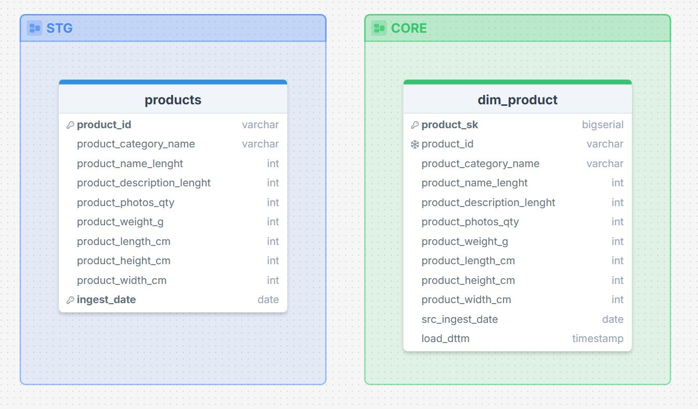

# Урок 2.1. Первые измерения CORE и полный загрузочный прогон (SCD1)

## Цели урока

- создаём схему `core` в Postgres;
- описываем структуру измерения `core.dim_product`;
- пишем full-load для `dim_product` из `stg.products` (последний `ingest_date`);
- проектируем и загружаем `core.dim_seller` из `stg.sellers`;
- делаем проверку counts-запросами и join-ами.

### 1. Пару слов о SCD:

- `dim_product` и `dim_seller` мы делаем как **SCD1**:
  - нас устраивает текущая категория товара и текущий город продавца;
  - историю переименований и переездов здесь не ведём.

### 2. Создаем `core.dim_product` (DDL + full-load)

### 2.1. Что переносим из `stg.products` в `core.dim_product`

Возьмём реальную структуру `stg.products`:

- `product_id`
- `product_category_name`
- `product_name_lenght`
- `product_description_lenght`
- `product_photos_qty`
- `product_weight_g`
- `product_length_cm`
- `product_height_cm`
- `product_width_cm`
- `ingest_date`



Первые 9 полей — это **описательные атрибуты товара**. `Ingest_date` — дата зарузки товара в STG.

Логика формирования `core.dim_product`:

1. Все описательные поля переносим **как есть.**
2. `Ingest_date` превращаем в техническое поле `src_ingest_date` (из какого среза STG мы взяли эту версию товара).
3. Добавляем surrogate key `product_sk`.
4. Добавляем техническое поле `load_dttm` (дата и время загрузки строки в CORE).

### 2.2. Создаём рабочий файл

```text
db/work/module02/m2_dims_full.sql
```

### 2.3. Создаем схему и таблицу:

```sql
-- создаём схему core
create schema if not exists core;

-- измерение товаров: SCD1
create table if not exists core.dim_product (
    product_sk                  bigserial primary key,  -- surrogate key в CORE

    -- бизнес-ключ и атрибуты товара (перенесены из stg.products)
    product_id                  varchar not null,
    product_category_name       varchar,
    product_name_lenght         int,
    product_description_lenght  int,
    product_photos_qty          int,
    product_weight_g            int,
    product_length_cm           int,
    product_height_cm           int,
    product_width_cm            int,

    -- технические поля CORE
    src_ingest_date             date,           -- откуда взяли (ingest в STG)
    load_dttm                   timestamptz default now()  -- когда загрузили в CORE (дата-время с часовым поясом)

);

-- уникальность по бизнес-ключу (одна строка на product_id в SCD1)
create unique index if not exists ux_dim_product_product_id
    on core.dim_product(product_id);
```

### 2.4. Наполнием core.dim_product

```sql
-- Full-load для core.dim_product из stg.products (последний ingest_date)

truncate table core.dim_product restart identity; -- restart identity сбрасывает счётчик product_sk в 1.

with max_ingest as (
    select max(ingest_date) as max_ingest_date
    from stg.products
)
insert into core.dim_product (
    product_id                  ,
    product_category_name       ,
    product_name_lenght         ,
    product_description_lenght  ,
    product_photos_qty          ,
    product_weight_g            ,
    product_length_cm           ,
    product_height_cm           ,
    product_width_cm            ,
    src_ingest_date             ,           
    load_dttm
)
select
    p.product_id                  ,
    p.product_category_name       ,
    p.product_name_lenght         ,
    p.product_description_lenght  ,
    p.product_photos_qty          ,
    p.product_weight_g            ,
    p.product_length_cm           ,
    p.product_height_cm           ,
    p.product_width_cm            ,
    p.ingest_date         as src_ingest_date,
    now()                 as load_dttm
from stg.products p
join max_ingest m
  on p.ingest_date = m.max_ingest_date;
```

### 2.5. Проверяем результат

Количество строк в dim_product

```sql
select count(*) from core.dim_product;
```

Результат
```text
count|
-----+
32951|
```

Проверяем дубли по product_id:

```sql
select count(*)                   as total_rows,
       count(distinct product_id) as distinct_products
from core.dim_product;
```

Результат
```text
total_rows|distinct_products|
----------+-----------------+
     32951|            32951|
```

### 3. Создаем `core.dim_seller` (DDL + full-load)

### 3.1. Что переносим из `stg.sellers` в `core.dim_seller`

Возьмём реальную структуру `stg.sellers`:

- `seller_id`
- `seller_zip_code_prefix`
- `seller_city`
- `seller_state`
- `ingest_date`

Логика формирования `core.dim_seller`:

1. Все описательные поля переносим **как есть.**
2. `Ingest_date` превращаем в техническое поле `src_ingest_date` (из какого среза STG мы взяли эту версию товара).
3. Добавляем surrogate key `seller_sk`.
4. Добавляем техническое поле `load_dttm` (дата и время загрузки строки в CORE).

### 3.2. Создаем таблицу:

```sql
-- измерение товаров: SCD1
create table if not exists core.dim_seller (
    seller_sk                  bigserial primary key,  -- surrogate key в CORE

    -- бизнес-ключ и атрибуты товара (перенесены из stg.products)
    seller_id                   varchar not null,
    seller_zip_code_prefix      varchar,
    seller_city                 varchar,
    seller_state                varchar,

    -- технические поля CORE
    src_ingest_date             date,           -- откуда взяли (ingest в STG)
    load_dttm                   timestamptz default now()  -- когда загрузили в CORE (дата-время с часовым поясом)

);

-- уникальность по бизнес-ключу (одна строка на seller_id в SCD1)
create unique index if not exists ux_dim_seller_seller_id
    on core.dim_seller(seller_id);
```

### 3.3. Наполняем core.dim_seller

```sql
-- Full-load для core.dim_seller из stg.sellers (последний ingest_date)

truncate table core.dim_seller restart identity; -- restart identity сбрасывает счётчик product_sk в 1.

with max_ingest as (
    select max(ingest_date) as max_ingest_date
    from stg.sellers
)
insert into core.dim_seller (
    seller_id                       ,
    seller_zip_code_prefix          ,
    seller_city                     ,
    seller_state                    ,
    src_ingest_date                 ,           
    load_dttm
)
select
    p.seller_id                     ,
    p.seller_zip_code_prefix        ,
    p.seller_city                   ,
    p.seller_state                  ,
    p.ingest_date as src_ingest_date,
    now()                as load_dttm
from stg.sellers p
join max_ingest m
  on p.ingest_date = m.max_ingest_date;
```

### 3.4. Проверяем результат

Количество строк в dim_seller

```sql
select count(*) from core.dim_seller;
```

Результат
```text
count|
-----+
 3095|
```

Проверяем дубли по seller_id:

```sql
select count(*)                   as total_rows,
       count(distinct seller_id) as distinct_sellers
from core.dim_seller;
```

Результат
```text
total_rows|distinct_sellers|
----------+----------------+
      3095|            3095|
```