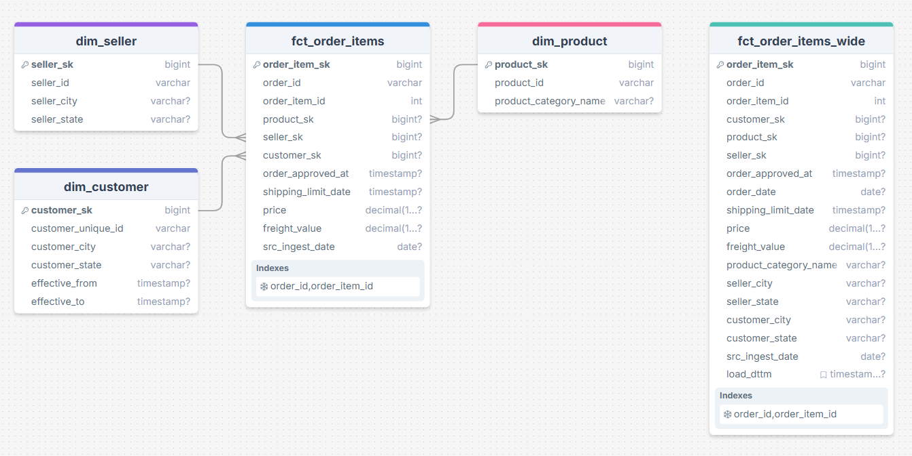

# Урок 4.1 — Wide-витрина: денормализация факта без агрегации

В этом уроке собираем базовую широкую витрину (**wide**). Она станет основой для агрегатов, DQ-проверок и дальнейшей оркестрации.

## Цели урока

- понять, что такое wide-витрина и зачем она нужна;
- зафиксировать **контракт витрины** (какие поля и какой grain);
- собирать витрину `marts.fct_order_items_wide` из CORE, **не ломая grain**;
- присоединить измерения и проверить результат простыми sanity-чеками;
- понять, как подключать `dim_customer` (SCD2) в зависимости от того, какие ключи лежат в факте (см. сноску в конце).

## 1. Что такое wide-витрина и зачем она нужна

**Wide-витрина** — это таблица, где:

- заранее выбраны нужные поля (**контракт**);
- заранее определён **grain** (гранулярность строк);
- данные **денормализованы** (в одной строке есть “контекст” из измерений);
- запросы по витрине должны быть быстрыми и предсказуемыми.

В нашем проекте wide-витрина будет:

> **`marts.fct_order_items_wide`**  
> **Grain:** 1 строка = 1 позиция заказа  
> **Назначение:** дать аналитике и BI уже собранный набор полей без повторного join с измерениями.

### Важный принцип

Если после join одна строка факта превращается в две, grain сломан.  
На маленьком `limit` это можно не заметить, но дальше метрики начнут искажаться.


## 2. Схема витрины (wide join chain)

Наша цепочка:

- `core.fct_order_items` — база (grain = позиция заказа)
- `core.dim_product` — добавляем атрибуты товара
- `core.dim_seller` — добавляем географию продавца
- `core.dim_customer` — добавляем географию клиента

Ключевой момент по клиенту (`dim_customer`, SCD2):

- если в факте **уже есть `customer_sk`**, витрина делает **обычный JOIN по `customer_sk`** (это базовый сценарий в практикуме);
- если в факте **нет `customer_sk`**, а есть только бизнес-ключ клиента + дата события, тогда нужен **as-of join** (см. сноску в конце).

Ниже — схема “wide join chain” (факт в центре, 3 измерения вокруг).



## 3.Варианты создания витрины

### Вариант A. Postgres-only

Пишем SQL-скрипт в `db/work/` и выполняем его в Postgres.

Плюсы:
- максимально воспроизводимо руками;
- витрина сразу живёт в Postgres и доступна BI;
- Airflow (модуль 7) легко подцепит этот SQL-файл.

### Вариант B. Spark-first

Считаем витрину в Spark (DataFrame API / SparkSQL), а результат записываем в Postgres через JDBC.

Плюсы:
- тренируем Spark-подход “считать трансформации в движке”;
- дальше можно масштабировать на большие объёмы.

Важно: **контракт и sanity-чеки по витрине всё равно фиксируются SQL-ом**, даже если исполняем логику в Spark.


## 4. Вариант A (Postgres): собираем `marts.fct_order_items_wide`

### 4.1. Готовим рабочий файл

```text
db/work/m4_01_build_wide.sql
```

### 4.2. Шаг 1. Создаём схему MARTS (если ещё нет)

```sql
create schema if not exists marts;
```

### 4.3. Шаг 2. Смотрим на факт: какие там ключи и какая дата заказа

Перед тем как писать JOIN-ы, нужно понять, какие поля есть в факте.

```sql
select column_name, data_type
from information_schema.columns
where table_schema = 'core'
  and table_name   = 'fct_order_items'
order by ordinal_position;
```

Если в факте уже есть `customer_sk`, значит версия клиента **уже выбрана** на слое CORE, и в MARTS делаем обычный JOIN по `customer_sk`.  
Если `customer_sk` нет — см. сноску в конце.


### 4.4. Важный момент: как мы ведём src_ingest_date в витринах

Чтобы в модуле 7 витрина вела себя предсказуемо, надо зафиксировать правило уже сейчас:

- `src_ingest_date` в MARTS = **batch id расчёта витрины**
- в модуле 4 задаю его руками (одной строкой)
- в модуле 7 вместо этого будет параметр Airflow (`ingest_date`)

Запоминаем “боевую” версию, которая появится в модуле 7:

```sql
'{{ dag_run.conf.get("ingest_date", params.ingest_date) }}'::date as src_ingest_date
```

### 4.5. Шаг 3. Фиксируем контракт wide-витрины

Минимальный набор полей (можно расширять):

**Ключи / grain**
- `order_item_sk`
- `order_id`
- `order_item_id`

**Ключи измерений (SK)**
- `product_sk`
- `seller_sk`
- `customer_sk`

**Поля факта**
- `order_approved_at`
- `order_date` *(обычно `order_approved_at::date`)*
- `shipping_limit_date`
- `price`
- `freight_value`
- `src_ingest_date`

**Поля измерений**
- из `dim_product`: `product_category_name`
- из `dim_seller`: `seller_city`, `seller_state`
- из `dim_customer`: `customer_city`, `customer_state`

**Технические поля витрины**
- `load_dttm`


### 4.6. Шаг 4. DDL: создаём таблицу wide (если ещё нет)

Делаем **full refresh**: каждый запуск перезаливает wide-витрину целиком.

```sql
create table if not exists marts.fct_order_items_wide (
    -- grain / keys
    order_item_sk         bigint primary key,
    order_id              varchar not null,
    order_item_id         int     not null,

    -- fk to dims (SK)
    customer_sk           bigint,
    product_sk            bigint,
    seller_sk             bigint,

    -- fact fields
    order_approved_at     timestamp,
    order_date            date,
    shipping_limit_date   timestamp,
    price                 numeric,
    freight_value         numeric,

    -- dim fields (минимальный MVP)
    product_category_name varchar,
    seller_city           varchar,
    seller_state          varchar,
    customer_city         varchar,
    customer_state        varchar,

    -- tech
    src_ingest_date       date,
    load_dttm             timestamptz default now()
);

create unique index if not exists ux_marts_wide_grain
    on marts.fct_order_items_wide(order_id, order_item_id);

create index if not exists ix_marts_wide_order_date
    on marts.fct_order_items_wide(order_date);

create index if not exists ix_marts_wide_category
    on marts.fct_order_items_wide(product_category_name);
```

---

### 4.7. Шаг 5. JOIN с `dim_customer (SCD2)` — базовый сценарий

Базовый сценарий:

- в `core.fct_order_items` есть `customer_sk`;
- значит, SCD2-логика (выбор версии клиента) уже учтена в CORE;
- в wide-витрине делаем **обычный JOIN по `customer_sk`**, без интервалов.

```sql
left join core.dim_customer c
  on c.customer_sk = f.customer_sk
```

### 4.8. Шаг 6. Собираем wide-витрину (full refresh)

```sql
begin;

truncate table marts.fct_order_items_wide;

insert into marts.fct_order_items_wide (
    order_item_sk,
    order_id,
    order_item_id,

    customer_sk,
    product_sk,
    seller_sk,

    order_approved_at,
    order_date,
    shipping_limit_date,
    price,
    freight_value,

    product_category_name,
    seller_city,
    seller_state,
    customer_city,
    customer_state,

    src_ingest_date,
    load_dttm
)
select
    f.order_item_sk,
    f.order_id,
    f.order_item_id,

    f.customer_sk,
    f.product_sk,
    f.seller_sk,

    f.order_approved_at,
    f.order_approved_at::date as order_date,
    f.shipping_limit_date,
    f.price,
    f.freight_value,

    p.product_category_name,
    s.seller_city,
    s.seller_state,
    c.customer_city,
    c.customer_state,

    '__INGEST_DATE__'::date as src_ingest_date,
    now() as load_dttm
from core.fct_order_items f
left join core.dim_product p
       on p.product_sk = f.product_sk
left join core.dim_seller s
       on s.seller_sk = f.seller_sk
left join core.dim_customer c
       on c.customer_sk = f.customer_sk;

commit;
```
Посмотрим на содержимое wide-витрину 

```sql
select *
from marts.fct_order_items_wide
limit 15
```

Результат
```text
order_item_sk|order_id                        |order_item_id|customer_sk|product_sk|seller_sk|order_approved_at      |order_date|shipping_limit_date    |price |freight_value|product_category_name|seller_city          |seller_state|customer_city |customer_state|src_ingest_date|load_dttm                    |
-------------+--------------------------------+-------------+-----------+----------+---------+-----------------------+----------+-----------------------+------+-------------+---------------------+---------------------+------------+--------------+--------------+---------------+-----------------------------+
           11|263ba12390d0fbce329dd16da8cd20f8|            1|     110115|     12858|     1874|2018-06-20 10:21:32.000|2018-06-20|2018-06-22 10:21:32.000|134.90|        12.43|cama_mesa_banho      |piracicaba           |SP          |sao paulo     |SP            |     2025-12-03|2026-04-20 13:50:24.476 +0300|
           13|728416b0db65935dbf78a0cc03e8d6f8|            2|      24036|      4601|      475|2018-02-08 07:49:51.000|2018-02-08|2018-02-14 07:49:51.000| 49.90|        17.60|ferramentas_jardim   |sao jose do rio preto|SP          |novo hamburgo |RS            |     2025-12-03|2026-04-20 13:50:24.476 +0300|
           14|728416b0db65935dbf78a0cc03e8d6f8|            1|      24036|      4601|      475|2018-02-08 07:49:51.000|2018-02-08|2018-02-14 07:49:51.000| 49.90|        17.60|ferramentas_jardim   |sao jose do rio preto|SP          |novo hamburgo |RS            |     2025-12-03|2026-04-20 13:50:24.476 +0300|
           15|728416b0db65935dbf78a0cc03e8d6f8|            4|      24036|      4601|      475|2018-02-08 07:49:51.000|2018-02-08|2018-02-14 07:49:51.000| 49.90|        17.60|ferramentas_jardim   |sao jose do rio preto|SP          |novo hamburgo |RS            |     2025-12-03|2026-04-20 13:50:24.476 +0300|
           16|728416b0db65935dbf78a0cc03e8d6f8|            3|      24036|      4601|      475|2018-02-08 07:49:51.000|2018-02-08|2018-02-14 07:49:51.000| 49.90|        17.60|ferramentas_jardim   |sao jose do rio preto|SP          |novo hamburgo |RS            |     2025-12-03|2026-04-20 13:50:24.476 +0300|
           19|bc3e295306ee4d3eba91aca49b0bb539|            2|      31515|     28576|     2063|2017-10-11 07:56:17.000|2017-10-11|2017-10-18 08:56:17.000| 15.00|         7.78|moveis_decoracao     |sao paulo            |SP          |jacarei       |SP            |     2025-12-03|2026-04-20 13:50:24.476 +0300|
           20|bc3e295306ee4d3eba91aca49b0bb539|            1|      31515|     28576|     2063|2017-10-11 07:56:17.000|2017-10-11|2017-10-18 08:56:17.000| 15.00|         7.78|moveis_decoracao     |sao paulo            |SP          |jacarei       |SP            |     2025-12-03|2026-04-20 13:50:24.476 +0300|
           26|9974509c32cb0fbfa567244ba1c29a64|            1|     114522|     24964|     2997|2018-01-14 20:38:23.000|2018-01-14|2018-01-18 20:38:23.000| 83.99|        16.35|cama_mesa_banho      |ibitinga             |SP          |uberlandia    |MG            |     2025-12-03|2026-04-20 13:50:24.476 +0300|
           31|e4606fed871d036cbc9acbbd4e3282f1|            1|       7653|     31828|     1581|2018-01-08 02:47:54.000|2018-01-08|2018-01-12 02:47:54.000|149.90|        12.25|esporte_lazer        |sao paulo - sp       |SP          |sao paulo     |SP            |     2025-12-03|2026-04-20 13:50:24.476 +0300|
           32|4ed7a5d31f58c9c3b20a61e3927db6d9|            1|      57981|        25|     1816|2018-05-08 21:11:37.000|2018-05-08|2018-05-13 21:11:37.000| 79.90|        12.70|moveis_decoracao     |curitiba             |PR          |sao paulo     |SP            |     2025-12-03|2026-04-20 13:50:24.476 +0300|
           35|b60b122b336eaee3323565272f117bec|            1|      97218|     24423|     1874|2018-01-08 20:48:33.000|2018-01-08|2018-01-12 20:48:33.000|199.90|        21.89|cama_mesa_banho      |piracicaba           |SP          |belo horizonte|MG            |     2025-12-03|2026-04-20 13:50:24.476 +0300|
           41|7ad292313f72d59700c72169ba543021|            1|      64590|     17507|     1133|2017-09-26 14:14:19.000|2017-09-26|2017-10-02 14:14:19.000| 37.90|        13.37|malas_acessorios     |borda da mata        |MG          |pirassununga  |SP            |     2025-12-03|2026-04-20 13:50:24.476 +0300|
           45|ee8dd407e306b0808fd6fddc17ea6f78|            1|     210276|     18458|      333|2018-04-14 02:30:34.000|2018-04-14|2018-04-19 02:30:34.000| 13.65|         8.29|eletronicos          |sao paulo            |SP          |cotia         |SP            |     2025-12-03|2026-04-20 13:50:24.476 +0300|
           55|c524e7bd2510f74fed9e94b894472306|            1|     156960|     16579|     2461|2018-08-13 18:15:09.000|2018-08-13|2018-08-15 18:15:09.000|229.00|        15.08|relogios_presentes   |navegantes           |SC          |rondonopolis  |MT            |     2025-12-03|2026-04-20 13:50:24.476 +0300|
           58|7182e129d91eb324a925d8f1f8221d88|            1|      86103|     25068|      287|2017-10-08 18:29:35.000|2017-10-08|2017-10-13 18:29:35.000|198.00|        16.14|relogios_presentes   |colombo              |PR          |biritiba-mirim|SP            |     2025-12-03|2026-04-20 13:50:24.476 +0300|
```

### 4.9. Шаг 7. Проверки качества (необходимый минимум)

#### Проверка 1. Количество строк wide совпадает с фактом

```sql
select
  (select count(*) from core.fct_order_items)          as core_cnt,
  (select count(*) from marts.fct_order_items_wide)    as wide_cnt;
```

Результат
```text
core_cnt|wide_cnt|
--------+--------+
  112650|  112650|
```

#### Проверка 2. Нет дублей по grain

```sql
select
  count(*) as total_rows,
  count(distinct (order_id, order_item_id)) as distinct_grain
from marts.fct_order_items_wide;
```

Результат
```text
total_rows|distinct_grain|
----------+--------------+
    112650|        112650|
```

`total_rows` должен равняться `distinct_grain`.

#### Проверка 3. Нет висящих ссылок на измерения

Здесь `missing dim` означает ситуацию, когда ключ в факте есть, но запись измерения не подтянулась в join.

```sql
select
  sum(case when f.product_sk  is not null and p.product_sk  is null then 1 else 0 end) as missing_product_dim,
  sum(case when f.seller_sk   is not null and s.seller_sk   is null then 1 else 0 end) as missing_seller_dim,
  sum(case when f.customer_sk is not null and c.customer_sk is null then 1 else 0 end) as missing_customer_dim
from core.fct_order_items f
left join core.dim_product  p on p.product_sk  = f.product_sk
left join core.dim_seller   s on s.seller_sk   = f.seller_sk
left join core.dim_customer c on c.customer_sk = f.customer_sk;
```

Результат
```text
missing_product_dim|missing_seller_dim|missing_customer_dim|
-------------------+------------------+--------------------+
                  0|                 0|                   0|
```

#### Проверка 4. `src_ingest_date` должен показывать один batch

```sql
select src_ingest_date, count(*) as rows_cnt
from marts.fct_order_items_wide
group by 1
order by 1;
```

Результат
```text
src_ingest_date|rows_cnt|
---------------+--------+
     2025-12-03|  112650|
```

Ожидание: ровно одна строка и дата = `2025-12-03`.

#### Проверка 5. Доля `NULL` в атрибуте

```sql
select
  count(*) as total_rows,
  sum(case when f.product_sk is not null and p.product_sk is null then 1 else 0 end) as no_product_join,
  sum(case when p.product_sk is not null and p.product_category_name is null then 1 else 0 end) as null_product_category
from core.fct_order_items f
left join core.dim_product p
  on p.product_sk = f.product_sk;
```

Результат
```text
total_rows|no_product_join|null_product_category|
----------+---------------+---------------------+
    112650|              0|                 1603|
```

## 5. Вариант B (Spark): считаем wide в Spark и пишем в Postgres

Этот путь полезен, если есть желание пройти проектный сценарий: трансформации считаются в Spark, витрина хранится в Postgres.

Каркас лежит здесь. Обязательно скопируй его в рабочий файл и не меняй исходный шаблон:
`notebooks/module04/templates/m4_01_wide_template.ipynb`

---

## Сноска: когда нужен as-of join для SCD2 (если в факте нет `customer_sk`)

Эта часть нужна **только если** в факте нет `customer_sk`, но есть бизнес-ключ клиента (например, `customer_unique_id`) и дата события (например, `order_date`).

### Минимальные условия применимости

1) В `core.dim_customer` есть интервалы версии: `effective_from`, `effective_to` (или `effective_to` может быть `NULL`).  
2) Эти интервалы живут в **той же шкале времени**, что и дата, которой “отрезаем” клиента (обычно `order_date`).  
3) В факте есть поле, по которому можно связать клиента по BK (`customer_unique_id` или аналог).

Быстрая диагностика шкал времени:

```sql
select
  min(order_approved_at::date) as min_order_date,
  max(order_approved_at::date) as max_order_date,
  min(src_ingest_date)         as min_ingest_date,
  max(src_ingest_date)         as max_ingest_date
from core.fct_order_items;

select
  min(effective_from) as min_eff_from,
  max(effective_to)   as max_eff_to
from core.dim_customer;
```

Если `effective_*` “похожи” на 2017–2018, логично резать по `order_date`.  
Если “похожи” на 2025-xx-xx, значит интервалы строились по ingest/load time, и as-of join по `order_date` будет некорректным.

### Пример as-of join (event time)

```sql
left join core.dim_customer c
  on c.customer_unique_id = f.customer_unique_id
 and f.order_date >= c.effective_from
 and f.order_date <  coalesce(c.effective_to, date '2999-12-31')
```

Нужно читать висящие ссылки по клиенту относительно самого as-of join. Проверки grain при этом остаются прежними.